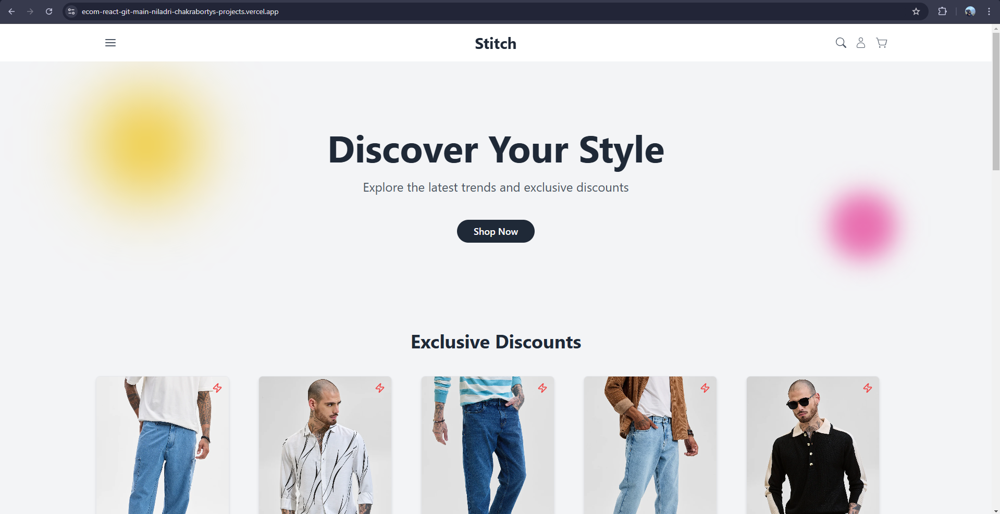

# Stitch - E-Commerce Web Application

Welcome to Stitch! A modern e-commerce web application designed for seamless shopping, secure transactions, and effortless browsing. Built with React.js and Spring Boot, Stitch offers dynamic product filtering, user authentication, and a smooth, responsive experience. Happy shopping! 🚀

<p align="center">
  
  
  
  
  
  
  
  
  
  
  
</p>

## Preview

<p align="center">
  
</p>

## Contributors

- [Kaustabh Basu](https://github.com/axon04)
- [Niladri Chakraborty](https://github.com/nil-official)
- [Devanjana Ghosh](https://github.com/tanu002)

## Table of Contents

- [Introduction](#introduction)
- [Features](#features)
- [Technologies Used](#technologies-used)
- [Installation](#installation)
- [Usage](#usage)
- [Contributing](#contributing)
- [License](#license)

## Introduction

Stitch: E-Commerce Web Application is a full-stack online shopping platform built with React.js on the frontend and Spring Boot on the backend. It offers a seamless user experience with JWT-based authentication, dynamic product filtering, and secure order processing. The platform supports category-wise browsing, discount-based filtering, and user account management, ensuring a smooth and efficient shopping experience. With an intuitive UI and robust backend security, Stitch is designed to be scalable, responsive, and user-friendly for both customers and administrators.

## Features

- 🔒 Secure Authentication & Authorization – Users can register, log in, and manage their accounts securely. Role-based access ensures proper user permissions.
- 🛍️ Comprehensive Product Listing & Search – Browse a wide range of products with advanced search and filtering options for a seamless shopping experience.
- 📄 Detailed Product Pages – View in-depth product descriptions, high-quality images, pricing details, and customer reviews.
- 🛒 Smart Shopping Cart Management – Easily add, remove, and update products in the cart with a real-time price calculation.
- 💳 Seamless Checkout & Payment Integration – Secure and smooth order placement with integrated payment gateways for hassle-free transactions.
- 📦 Order Tracking & Management – Users can view order history, track shipments, and receive real-time order status updates.
- 🎯 Wishlist & Favorites – Save products for later with a personalized wishlist feature.
- 📱 Responsive & Mobile-Friendly Design – Optimized for all devices, providing a smooth shopping experience across mobile, tablet, and desktop.
- ⚡ Fast & Scalable Performance – Built with React.js and Spring Boot for a high-performance and scalable e-commerce experience.

## Technologies Used

- 🌐 Frontend: React.js, Tailwind CSS (for modern UI styling), Redux (for state management)
- 🖥️ Backend: Spring Boot (RESTful API development), Spring Security (authentication & authorization), JWT (token-based authentication)
- 🗄️ Database: PostgreSQL (relational database for storing user and product data)
- 💳 Payment Integration: Razorpay (secure online transactions)
- 🔍 Search & Filtering: Elasticsearch / Custom filters (efficient product search functionality)
- 📦 Deployment & Hosting: Vercel (for frontend), Railway (for backend), Render (for postgres database)
- 📡 API Integration: RESTful APIs (seamless data exchange), Postman (API testing)

## Installation

To get started with Stitch, follow these steps:

### Backend Setup

1. **Clone the repository:**

   ```bash
   git clone https://github.com/nil-official/Stitch.git
   cd Stitch
   ```

2. **Navigate to the backend directory:**

   ```bash
   cd server
   ```

3. **Configure the application properties:** Create an `application-dev.properties` file inside `src/main/resources/` and add the following configurations:

    ```markdown
    #PORT
    server.port=5454
    #DB Specific Properties
    spring.datasource.url=<your_postgres_datasource_url>
    spring.datasource.driver-class-name=org.postgresql.Driver
    spring.datasource.username=<your_postgres_db_username>
    spring.datasource.password=<your_postgres_db_password>
    #ORM S/W Specific Properties
    spring.jpa.hibernate.ddl-auto=update
    spring.jpa.show-sql=true
    #SMTP Server Configurations
    spring.mail.host=<your_smtp_host>
    spring.mail.port=<your_smtp_port>
    spring.mail.username=<your_smtp_mail>
    spring.mail.password=<your_smtp_password>
    spring.mail.properties.mail.smtp.auth=true
    spring.mail.properties.mail.smtp.starttls.enable=true
    #Razor Pay
    razorpay.api.key=<your_razorpay_key_id>
    razorpay.api.secret=<your_razorpay_key_secret>
    #Base Urls
    frontend.base.url=http://localhost:5173
    backend.base.url=http://localhost:5454
    ```

4. **Build and run the backend server:**

    ```bash
    ./mvnw spring-boot:run
    ```

The server will run on `http://localhost:5454`.

### Frontend Setup

1. **Navigate to the frontend directory:**

   ```bash
   cd ../client
   ```

2. **Install frontend dependencies:**

   ```bash
   npm install
   ```

3. **Set up environment variables:** Create a `.env` file in the `client` directory and add these:

   ```markdown
    NODE_ENV=<development/production>
    VITE_API_URL=http://localhost:5454
   ```

4. **Start the frontend:**

   ```bash
   npm run dev
   ```

The application will be available at `http://localhost:5173`.

## Usage

Once the development server is running, you can explore the application in your browser. You can register a new account, browse products, add items to your cart, and proceed to checkout.

## Contributing

We welcome contributions to the Stitch! If you have any ideas, suggestions, or bug reports, please open an issue or submit a pull request. Follow these steps to contribute:

1. **Fork the repository**

2. **Create a new branch:**

   ```bash
   git checkout -b feature/your-feature-name
   ```

3. **Make your changes**

4. **Commit your changes:**

   ```bash
   git commit -m 'Add some feature'
   ```

5. **Push to the branch:**

   ```bash
   git push origin feature/your-feature-name
   ```

6. **Open a pull request**

## License

This project is licensed under the MIT License. See the [LICENSE](LICENSE) file for more details.

Thank you for using Stitch! Happy shopping!
